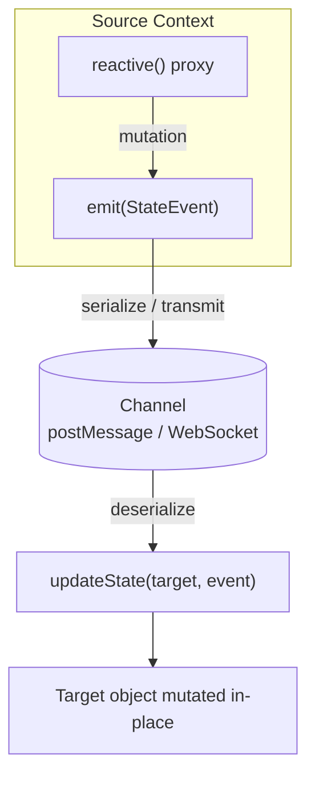

# updateState

Applies a state change event to an object. This function is particularly useful for synchronizing state changes between different contexts, such as between the main thread and a worker, or between server and client.

## Signature

```ts
function updateState(target: any, event: StateEvent): void;
```

## Parameters

- `target`: The object to update, which can be a plain object or contain specialized collections (Map, Set, Array).
- `event`: A `StateEvent` object describing the change to apply.

## StateEvent Interface

```ts
interface StateEvent {
  // Determines the type of operation to perform
  action:
    | "set"
    | "delete"
    | "array-push"
    | "array-pop"
    | "array-splice"
    | "array-shift"
    | "array-unshift"
    | "map-set"
    | "map-delete"
    | "map-clear"
    | "set-add"
    | "set-delete"
    | "set-clear"
    | "replace";

  // Path to the collection or parent object affected by the change
  path: (string | number)[];

  // Common fields (populated depending on the action)
  newValue?: any; // For 'set', 'map-set', 'replace'
  oldValue?: any; // For 'set', 'delete', pop/shift, etc.

  // Array & Map
  key?: any; // Array index for splice OR Map key for map-set/delete
  deleteCount?: number; // splice only
  items?: any[]; // splice / push / unshift
  oldValues?: any[]; // items removed by splice

  // Set
  value?: any; // Added/removed value for set-add / set-delete
}
```

## Examples

### Setting a Property Value

```ts
import { updateState } from "@yiin/reactive-proxy-state";

const obj = { count: 0 };

// Update the 'count' property
updateState(obj, {
  action: "set",
  path: ["count"],
  newValue: 1,
});

console.log(obj.count); // 1
```

### Replacing a Value

```ts
import { updateState } from "@yiin/reactive-proxy-state";

const state = {
  user: {
    name: "John",
    age: 30,
    settings: {
      theme: "light",
      notifications: true,
    },
  },
};

// Completely replace the user object
updateState(state, {
  action: "replace",
  path: ["user"],
  newValue: {
    name: "Jane",
    age: 28,
    settings: {
      theme: "dark",
      notifications: false,
    },
  },
});

console.log(state.user);
// {
//   name: 'Jane',
//   age: 28,
//   settings: {
//     theme: 'dark',
//     notifications: false
//   }
// }
```

### Updating a Nested Property

```ts
import { updateState } from "@yiin/reactive-proxy-state";

const user = {
  profile: {
    name: "John",
    settings: {
      theme: "light",
    },
  },
};

// Update a nested property
updateState(user, {
  action: "set",
  path: ["profile", "settings", "theme"],
  newValue: "dark",
});

console.log(user.profile.settings.theme); // 'dark'
```

### Working with Maps

```ts
import { updateState } from "@yiin/reactive-proxy-state";

const state = {
  preferences: new Map([["theme", "light"]]),
};

// Add a new key-value pair to the Map using 'map-set'
updateState(state, {
  action: "map-set",
  path: ["preferences"], // Path to the Map itself
  key: "language", // The key to set
  newValue: "en", // The value for the key
});

// Delete a key from the Map
updateState(state, {
  action: "map-delete",
  path: ["preferences"],
  key: "theme",
});

console.log(state.preferences.get("language")); // 'en'
console.log(state.preferences.has("theme")); // false
```

### Working with Sets

```ts
import { updateState } from "@yiin/reactive-proxy-state";

const state = {
  tags: new Set(["important"]),
};

// Add a value to the Set
updateState(state, {
  action: "set-add",
  path: ["tags"],
  value: "urgent",
});

// Remove a value from the Set
updateState(state, {
  action: "set-delete",
  path: ["tags"],
  value: "important",
});

console.log(Array.from(state.tags)); // ['urgent']
```

### Working with Arrays

```ts
import { updateState } from "@yiin/reactive-proxy-state";

const state = {
  items: ["apple", "banana", "orange"],
};

// Add 'pear' at the end using array-splice
updateState(state, {
  action: "array-splice",
  path: ["items"], // Path to the array
  key: 3, // Start index (end of current array)
  deleteCount: 0, // Don't delete any elements
  items: ["pear"], // Add 'pear'
});
// state.items is now ['apple', 'banana', 'orange', 'pear']

// Remove 'apple' using array-splice
updateState(state, {
  action: "array-splice",
  path: ["items"],
  key: 0, // Start index
  deleteCount: 1, // Remove 1 element
});

console.log(state.items); // ['banana', 'orange', 'pear']
```

### Applying Multiple Updates

You can apply multiple state events sequentially:

```ts
import { updateState } from "@yiin/reactive-proxy-state";

const state = {
  count: 0,
  user: { name: "John" },
  items: ["apple"],
  tags: new Set(["draft"]),
};

const events = [
  { action: "set", path: ["count"], newValue: 1 },
  { action: "set", path: ["user", "name"], newValue: "Jane" },
  { action: "set", path: ["items", "1"], newValue: "banana" },
  { action: "set-add", path: ["tags"], value: "important" },
];

// Apply all updates
events.forEach((event) => updateState(state, event));

console.log(state.count); // 1
console.log(state.user.name); // 'Jane'
console.log(state.items); // ['apple', 'banana']
console.log(Array.from(state.tags)); // ['draft', 'important']
```

## Use Cases



1. **State Synchronization**: Apply changes from one context to another (e.g., main thread to worker).
2. **Remote State Management**: Serialize state changes for transmission over a network.
3. **Undo/Redo Functionality**: Record state events for implementing undo/redo.
4. **Time-Travel Debugging**: Replay a series of state events to reconstruct a specific state.
5. **Initial State Sync**: Use the 'replace' action to initialize or reset state with a complete value.

## Notes

- `updateState` does not validate paths or actions. It's assumed that the events are valid and match the structure of the target object.
- For optimal performance, prefer batching multiple state updates when possible.
- If applying events to a reactive state, be aware that each call to `updateState` might trigger reactive effects.
- The 'replace' action is especially useful for initial state synchronization or for completely resetting a section of your state tree.

## Related

- [`reactive`](/api/reactive) – emits the `StateEvent` objects that `updateState` consumes for synchronization
